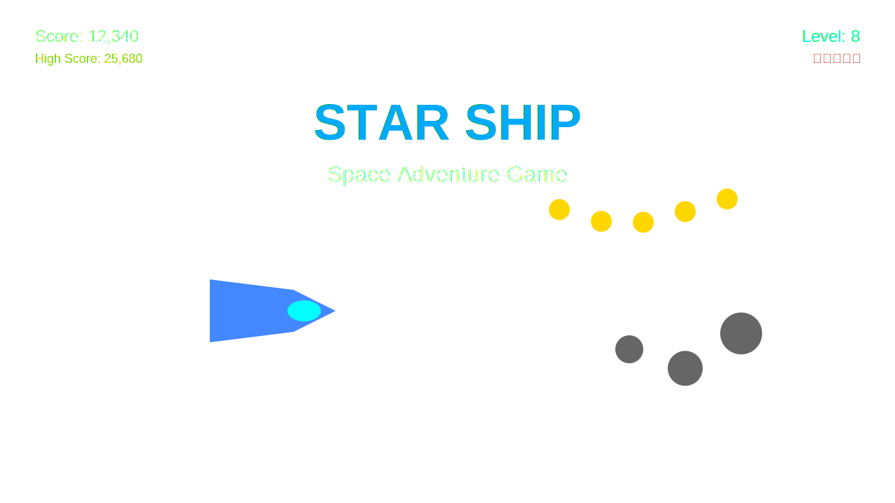

# 🚀 Star Ship - Space Adventure Game

A fun space dodge game where you collect coins and avoid asteroids! Built with HTML5, JavaScript, and lots of ❤️.



## 🎮 How to Play

- **Move Up**: ↑ Arrow key or touch the ⬆️ button
- **Move Down**: ↓ Arrow key or touch the ⬇️ button
- **Collect**: 🪙 Gold coins for points
- **Avoid**: ☄️ Gray asteroids (they hurt!)
- **Survive**: You have 3 lives ❤️❤️❤️
- **Level Up**: Every 45 seconds the game gets faster!

## ✨ Features

- 🌟 **Progressive Web App** - Install on any device!
- 📱 **Mobile Friendly** - Touch controls for phones/tablets
- 🎵 **Dynamic Audio** - Procedural music and sound effects
- 🎨 **Beautiful Graphics** - SVG sprites that scale perfectly
- ⚡ **Offline Play** - Works without internet connection
- 🏆 **High Score** - Saved locally in your browser
- 🎮 **Smooth Controls** - Responsive spaceship movement
- 🌌 **Parallax Background** - Multi-layer scrolling starfield

## 🛠️ Development

### Prerequisites
- Node.js (for build tools)
- Python 3 (for local server)
- Modern web browser

### Quick Start
```bash
# Clone the repository
git clone https://github.com/yourusername/starship.git
cd starship

# Start development server
npm run dev

# Open browser to http://localhost:8080
```

### Build Commands
```bash
# Generate PWA icons
npm run icons

# Build for production
npm run build

# Preview production build
npm run preview

# Deploy to GitHub Pages
npm run deploy:github

# Generate deployment configs
npm run deploy:config
```

## 📦 Project Structure

```
starship/
├── index.html          # Main game page
├── manifest.json       # PWA manifest
├── sw.js              # Service worker for offline support
├── css/
│   └── style.css      # Game styles and responsive design
├── js/
│   ├── game.js        # Main game logic and state management
│   ├── spaceship.js   # Player spaceship class
│   ├── asteroid.js    # Obstacle system
│   ├── coin.js        # Collectible system
│   ├── background.js  # Parallax starfield
│   ├── collision.js   # Collision detection
│   ├── audio.js       # Sound effects and music
│   └── touch.js       # Mobile touch controls
├── assets/
│   ├── images/        # SVG sprites
│   ├── icons/         # PWA icons (generated)
│   ├── screenshots/   # App store screenshots
│   └── sounds/        # Audio files (optional)
├── build.js           # Build script
├── deploy.js          # Deployment script
├── generate-icons.js  # Icon generator
└── dist/              # Production build output
```

## 🚀 Deployment Options

### 1. GitHub Pages (Free & Easy)
```bash
npm run deploy:github
```
Your game will be live at: `https://yourusername.github.io/starship`

### 2. Netlify (Drag & Drop)
1. Run `npm run build`
2. Drag the `dist` folder to [netlify.com](https://netlify.com)
3. Get instant URL!

### 3. Vercel (Auto-Deploy)
1. Push to GitHub
2. Connect repository at [vercel.com](https://vercel.com)
3. Auto-deploys on every push

### 4. Other Platforms
- **Firebase Hosting**: `npm run deploy:config` then follow Firebase docs
- **Surge.sh**: `cd dist && surge`
- **Your own server**: Copy `dist` folder contents

## 📱 PWA Installation

### Desktop (Chrome, Edge, etc.)
1. Visit the game URL
2. Look for "Install" button in address bar
3. Click to install as desktop app

### Mobile (iOS Safari)
1. Open game in Safari
2. Tap share button
3. Select "Add to Home Screen"

### Mobile (Android Chrome)
1. Open game in Chrome
2. Tap "Add to Home Screen" prompt
3. Or use Chrome menu → "Install app"

## 🎨 Customization

### Adding Your Own Graphics
Replace the SVG files in `assets/images/`:
- `spaceship.svg` - Player ship
- `asteroid.svg` - Obstacles
- `coin.svg` - Collectibles

### Adding Music
Add an MP3 file at `assets/sounds/background-music.mp3` - it will play automatically!

### Tweaking Gameplay
Edit `CONFIG` object in `js/game.js`:
```javascript
const CONFIG = {
    spaceship: {
        speed: 400,        // Spaceship speed
        lives: 3,          // Starting lives
    },
    level: {
        duration: 45000    // 45 seconds per level
    }
    // ... more options
};
```

## 🏆 Game Stats & Features

| Feature | Status |
|---------|--------|
| **Responsive Design** | ✅ Works on all screen sizes |
| **Touch Controls** | ✅ Mobile-friendly buttons |
| **Offline Play** | ✅ Service worker caching |
| **PWA Install** | ✅ Add to home screen |
| **Sound Effects** | ✅ Procedural audio generation |
| **High Score** | ✅ Session-based storage |
| **Level Progression** | ✅ Increasing difficulty |
| **Collision Detection** | ✅ Precise hit detection |
| **Smooth Animation** | ✅ 60 FPS gameplay |

## 🤝 Contributing

Contributions welcome! Ideas for new features:
- Power-ups system
- Multiple spaceships to unlock
- Boss battles
- Achievements system
- Multiplayer mode

## 📄 License

MIT License - feel free to use this code for your own projects!

## 🎯 Credits

- **Game Engine**: Vanilla JavaScript + HTML5 Canvas
- **Graphics**: Custom SVG artwork
- **Audio**: Web Audio API procedural generation
- **Icons**: Generated with custom SVG templates

---

### 🎮 Ready to play?

**[▶️ PLAY NOW](https://yourusername.github.io/starship)**

Made with ❤️ for kids and space game enthusiasts!